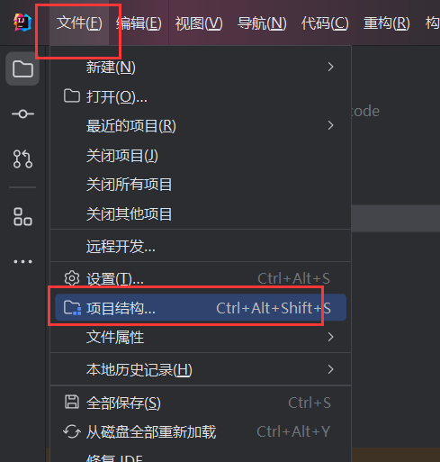
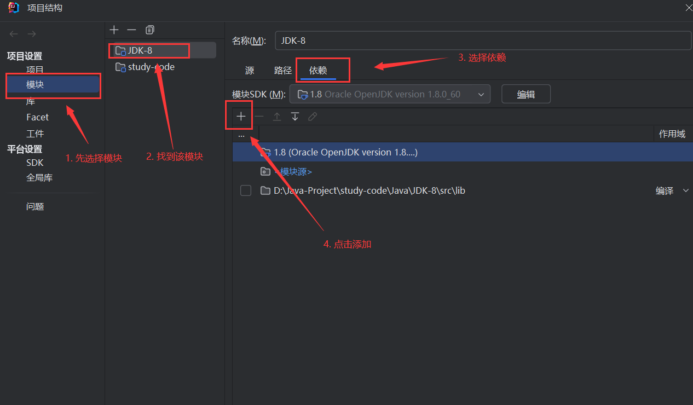
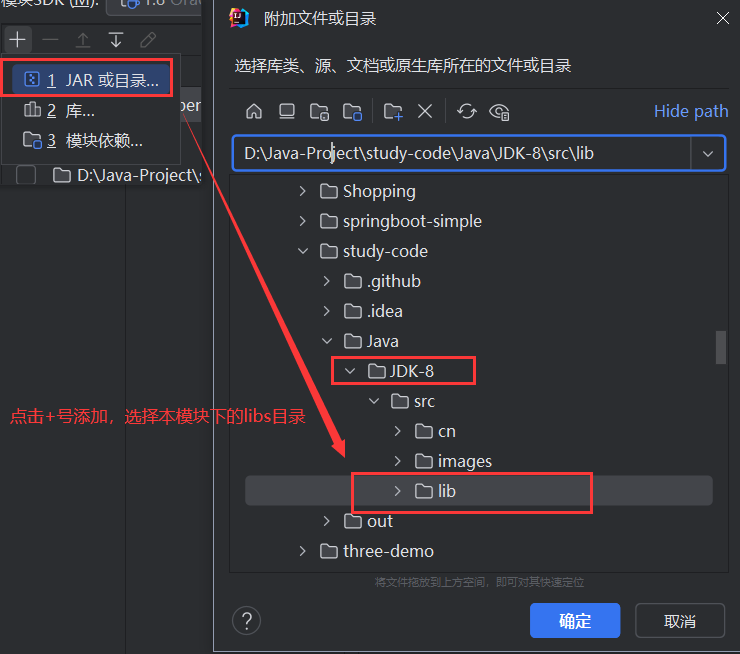
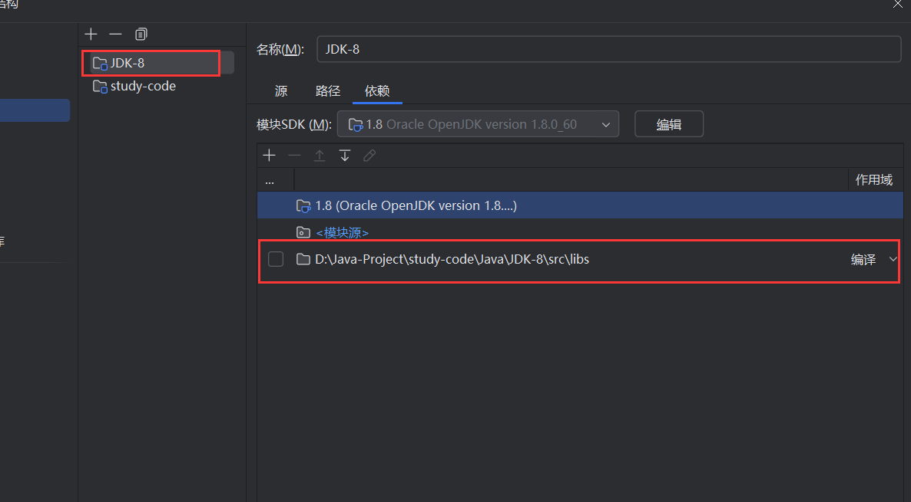

# JDK-8

#### 配置说明
要成功运行本模块下内容，需要JDK8的环境，并且需要导入模块下的jar包，导包方法具体如下：
1. 点击`文件`下的`项目结构`

2. 首先选择`模块`选项，再找到当前的模块`JDK-8`选中，点击`依赖`选项，点击`+`号，选择`JAR或目录`，选择当前模块下的`libs`文件夹，点击确定。

3. 最终导入的jar包如下：

4. 点击`确定`，完成导入。

#### 内容说明

1.  stream: JDK8新特性，流式编程，常用的API
2.  io： IO流，常用API的各个方法
3.  thread： 线程相关
